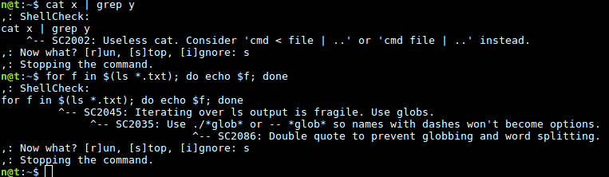
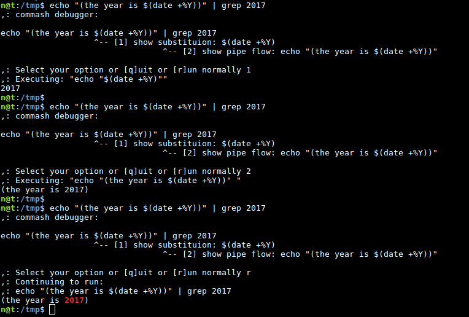

# commash
Comma-shell, an interactive shell debugger

# installation
Since this is not a stable release, it's highly recommended to install commash into a virtual machine.
You can found my Virtualbox setup at the end of this README.
Install dependencies, clone commash into your home directory and run the main file. The rest will be installed automatically. Please note, that building ShellCheck takes a lot of time.

    sudo apt update
    sudo apt install git cabal-install python-pip xdotool -y
    sudo pip install bashlex
    git clone https://github.com/nesro/commash ~/.commash
    source ~/.commash/comma.sh

# notfound hook
With pre and post hooks, it's easy to extend basic functionality. Commash's "notfound handler" is an example that triggers when return code of a command is 127.

# shellcheck hook

Shellcheck is a static analysis tool for shell scripts. Our hook can run it before executing commands and prevent the execution.

# bashlex based debugger
bashlex is used for parsing the command. so we run only parts

Example of debugging a for cycle. You can see a whole list of items that the loop will iterate, or you can run the body of the for with custom iterator value.

# safe commands
Commash can alias basics commands (such as rm) and builtins (such as cd) to internal functions written in bash. It can provide more verbose information, tips and it allows easily to revert the command you run (such as restore deleted file).

- https://www.gnu.org/software/coreutils/coreutils.html
- http://lingrok.org/xref/coreutils/tests/

# rm safe command

rm wrapper shows you which files are you going to delete and can put them in a trash instead. It also can restore (from the trash) files from a single rm command, even if that command deleted multiple files. rm wrapper uses the freedesktop.org trashcan implementation using trash-cli.

# script debugger

Commash comes with a [Bashlex](https://github.com/idank/bashlex) based script debugger. It's not meant to be as powerful as [Bash Debugger](http://bashdb.sourceforge.net/), but easier and faster to use.

# diploma thesis
This work is being done as my diploma thesis, here are instructions in the czech language:
 - czech title: Comma-shell, interaktivní debugger shellu
 - english title: Comma-shell, an interactive shell debugger
 - Proveďte rešerši existujících nástrojů pro statickou analýzu, krokování a hledání chyb v BASH skriptech.
 - Navrhněte a implementujte nástroj, který umožní psát uživatelské skripty pro analýzu příkazů a ovlivňování jejich spouštění a vykonávání. Nástroj musí umožňovat krokovat složitější skripty po jednotlivých příkazech. Pro analýzu spouštěných skriptů využijte vhodný nástroj z rešeršní části.
 - Vytvořte ukázkové skripty pro zvrácení, či zamezení efektů základních příkazů z GNU coreutils. Zaznamenávejte jejich spouštění a umožněte jimi provedené změny vrátit do původního stavu.

# virtual machine

I know that you know how to setup a VM. I just want to share my tested setup.

My Virtualbox version is 5.0.32_Ubuntu r112930 and I'm running Ubuntu 16.04. Image and parameters:

    image: http://gensho.acc.umu.se/debian-cd/current/amd64/iso-cd/debian-8.7.1-amd64-lxde-CD-1.iso
    md5sum: 0b03a80416799d064c985bd5ca1e5f68
    2GB RAM (this is important because building Haskell programs needs a lot of memory)
    8GB disk space

Add you (a user) to the sudoers group:

    su
    adduser username sudo

Comment out the installation CD and add "contrib non-free" sources:

    sudo vi /etc/apt/sources.list

Install virtualbox guest additions so that you can copy from outside of VM:

    sudo apt update
    sudo apt install virtualbox-guest-dkms virtualbox-guest-utils virtualbox-guest-x11 virtualbox-guest-additions-iso
